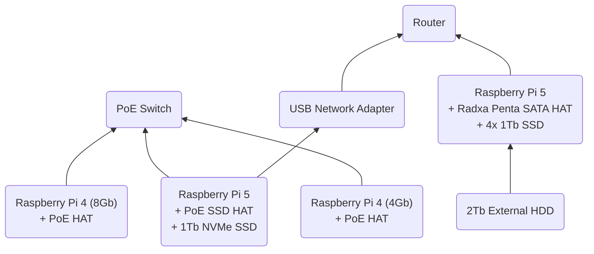

# PiCluster

1. [Hardware List and Architecture](#hardware-list-and-architecture)
2. [Setup Ansible](#setup-ansible)
3. [Nodes and Network Setup](#nodes-and-network-setup)
    - [Head Node](#head-node)
    - [First Worker Node](#first-worker-node)
    - [Additional Worker Nodes](#additional-worker-nodes)
    - [Pi NAS](#pi-nas)
4. [Docker Swarm Setup](#docker-swarm-setup)
    - [Initialize Docker Swarm](#initialize-docker-swarm)
    - [Add Worker Nodes](#add-worker-nodes)
    - [Add Pi NAS Storage](#add-pi-nas-storage)
5. [Deploy Services](#deploy-services)
    - [Portainer](#portainer)
    - [Traefik](#traefik)
    - [Prometheus](#prometheus)
    - [Grafana](#grafana)
    - [Pi-hole](#pi-hole)
    - [Jellyfin](#jellyfin)

Code and Documentation for setting up a RaspberryPi Cluster with Docker Swarm.

## Hardware List and Architecture

### Cluster
The following hardware is used to build the cluster:
1. Raspberry Pis:
    - 1x Raspberry Pi 5 Model B 8GB
    - 1x Raspberry Pi 4 Model B 8GB
    - 1x Raspberry Pi 4 Model B 4GB
2. 2x PoE HATs for Raspberry Pi 4s
3. 1x PoE + SSD HAT for Raspberry Pi 5
4. 1x 1TB M.2 NVMe SSD
5. 1x PoE Switch 8 Port
6. 1x Ethernet USB Adapter
7. Ethernet Cables
8. 1x Micro SD Card for initial setup
9. 1x Cluster Case

### Pi NAS

The following hardware is used to build the Pi NAS:
1. 1x Raspberry Pi 5 Model B 8GB
2. 1x Radxa Penta SATA HAT
3. 4x 1TB 2.5" SSDs
4. 1x Micro SD Card
5. 1x Ethernet cable
6. 1x 12V 5A Power Supply Barrel Jack
7. 1x 2TB External HDD

### Additional Hardware

1. 1x Router


## Setup Ansible

We will use Ansible to automate the setup and operation of the cluster. The following steps will guide you through the installation of Ansible. 

1. Install Ansible in your local machine by running the following command:
```bash
pip3 install ansible
```
> Very complex!

## Nodes and Network Setup

Most of this guide was based on the [How to build a Raspberry Pi cluster](https://www.raspberrypi.com/tutorials/cluster-raspberry-pi-tutorial/) article.

### Head Node

We will use a Raspberry Pi 5 as the head node of the cluster as well as the server for network booting the other Raspberry Pis.
The OS will be installed on the 1TB NVMe SSD.

#### NVMe Boot
1. Mount the PoE SSD HAT and 1Tb NVMe SSD on the Raspberry Pi 5.
2. Boot the Raspberry Pi 5 with network cable connected to an internet source.
3. Format your NVMe drive using Raspberry Pi Imager. You can do this from the Raspberry Pi.
    - Install the Raspberry Pi OS Lite on the NVMe drive.
    - Make sure to setup the wifi connection and enable SSH.
    - Name it `picluster-head`.
4. In a terminal on the Raspberry Pi, run `sudo raspi-config` to open the Raspberry Pi Configuration CLI.
5. Under `Advanced Options > Boot Order`, choose `NVMe/USB boot`. Then, exit `raspi-config` with Finish or the Escape key.
6. Reboot your Raspberry Pi with `sudo reboot`.

For more information, see [NVMe boot](https://www.raspberrypi.com/documentation/computers/raspberry-pi.html#nvme-ssd-boot).

#### Network Configuration
1. Connect to the Raspberry Pi 5 via SSH.
2. Connect the USB network adapter to the Raspberry Pi 5.
3. Run `nmcli` to get the name of the network interface.
4. Set the onboard ethernet interface to a static IP address by running the following commands:
```bash
sudo nmcli con mod "Wired connection 1" ipv4.addresses 192.168.50.1/24 ipv4.method manual
sudo nmcli con down "Wired connection 1"
sudo nmcli con up "Wired connection 1"
```

### First Worker Node

### Additional Worker Nodes

### Pi NAS

## Docker Swarm Setup

### Initialize Docker Swarm

### Add Worker Nodes

### Add Pi NAS Storage


## Deploy Services

### Portainer

### Traefik

### Prometheus

### Grafana

### Pi-hole

### Jellyfin

