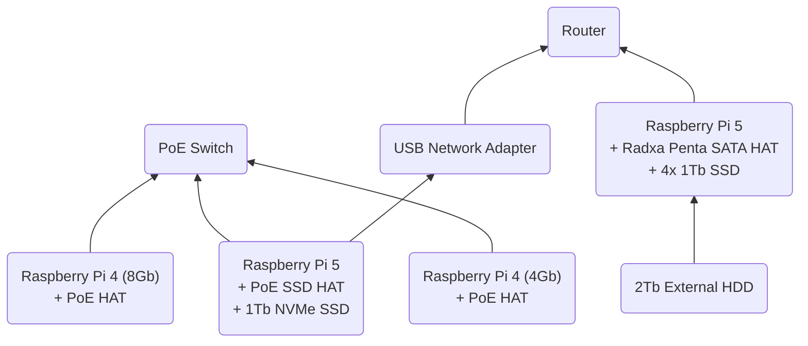

# PiCluster

Code and Documentation for setting up a RaspberryPi Cluster with Docker Swarm.

## Hardware Architecture

### Cluster
The following hardware is used to build the cluster:
1. Raspberry Pis:
    - 1x Raspberry Pi 5 Model B 8GB
    - 1x Raspberry Pi 4 Model B 8GB
    - 1x Raspberry Pi 4 Model B 4GB
2. 2x PoE HATs for Raspberry Pi 4s
3. 1x PoE + SSD HAT for Raspberry Pi 5
4. 1x 1TB M.2 NVMe SSD
5. 1x PoE Switch 8 Port
6. 1x Ethernet USB Adapter
7. Ethernet Cables
8. 1x Micro SD Card for initial setup
9. 1x Cluster Case

### Pi NAS

The following hardware is used to build the Pi NAS:
1. 1x Raspberry Pi 5 Model B 8GB
2. 1x Radxa Penta SATA HAT
3. 4x 1TB 2.5" SSDs
4. 1x Micro SD Card
5. 1x Ethernet cable
6. 1x 12V 5A Power Supply Barrel Jack
7. 1x 2TB External HDD

### Additional Hardware

1. 1x Router


## Setup Ansible

We will use Ansible to automate the setup and operation of the cluster. The following steps will guide you through the installation of Ansible. 

1. Install Ansible in your local machine by running the following command:
```bash
pip3 install ansible
```
> Very complex!

## Next Steps

1. [Setup Cluster](./docs/cluster-setup.md)
2. [Setup Pi NAS](./docs/pi-nas.md)
3. [Setup Docker Swarm](./docs/docker-swarm-init.md)
4. Deploy Services:
    - [Portainer](./docs/services/portainer.md)
    - [Traefik](./docs/services/traefik.md)
    - [Pi-hole](./docs/services/pi-hole.md)
    - [Jellyfin](./docs/services/jellyfin.md)

