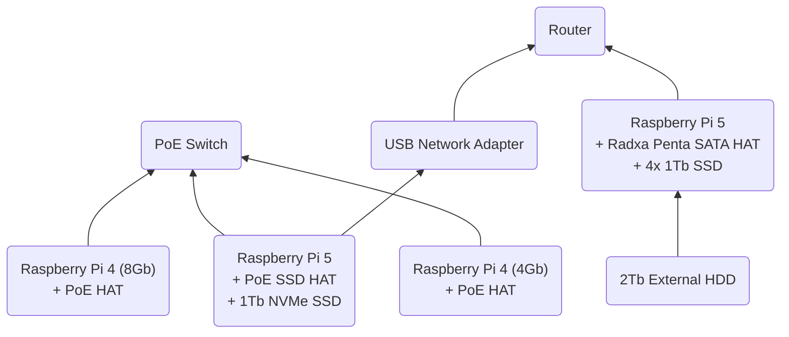

# PiCluster

1. [Hardware List and Architecture](#hardware-list-and-architecture)
2. [Setup Ansible](#setup-ansible)
3. [Nodes and Network Setup](#nodes-and-network-setup)
    - [Head Node](#head-node)
    - [First Worker Node](#first-worker-node)
    - [Additional Worker Nodes](#additional-worker-nodes)
    - [Pi NAS](#pi-nas)
4. [Docker Swarm Setup](#docker-swarm-setup)
    - [Initialize Docker Swarm](#initialize-docker-swarm)
    - [Add Worker Nodes](#add-worker-nodes)
    - [Add Pi NAS Storage](#add-pi-nas-storage)
5. [Deploy Services](#deploy-services)
    - [Portainer](#portainer)
    - [Traefik](#traefik)
    - [Prometheus](#prometheus)
    - [Grafana](#grafana)
    - [Pi-hole](#pi-hole)
    - [Jellyfin](#jellyfin)

Code and Documentation for setting up a RaspberryPi Cluster with Docker Swarm.

## Hardware List and Architecture

### Cluster
The following hardware is used to build the cluster:
1. Raspberry Pis:
    - 1x Raspberry Pi 5 Model B 8GB
    - 1x Raspberry Pi 4 Model B 8GB
    - 1x Raspberry Pi 4 Model B 4GB
2. 2x PoE HATs for Raspberry Pi 4s
3. 1x PoE + SSD HAT for Raspberry Pi 5
4. 1x 1TB M.2 NVMe SSD
5. 1x PoE Switch 8 Port
6. 1x Ethernet USB Adapter
7. Ethernet Cables
8. 1x Micro SD Card for initial setup
9. 1x Cluster Case

### Pi NAS

The following hardware is used to build the Pi NAS:
1. 1x Raspberry Pi 5 Model B 8GB
2. 1x Radxa Penta SATA HAT
3. 4x 1TB 2.5" SSDs
4. 1x Micro SD Card
5. 1x Ethernet cable
6. 1x 12V 5A Power Supply Barrel Jack
7. 1x 2TB External HDD

### Additional Hardware

1. 1x Router


## Setup Ansible

We will use Ansible to automate the setup and operation of the cluster. The following steps will guide you through the installation of Ansible. 

1. Install Ansible in your local machine by running the following command:
```bash
pip3 install ansible
```
> Very complex!

Or use Semaphore UI to manage Ansible. For that, use the [docker-compose](./docker/ansible-semaphore/docker-compose.yml) to start the application.
> Check out their [docs](https://docs.semaphoreui.com/) for more information.

## Nodes and Network Setup

Most of this guide was based on the [How to build a Raspberry Pi cluster](https://www.raspberrypi.com/tutorials/cluster-raspberry-pi-tutorial/) article.

### Head Node

We will use a Raspberry Pi 5 as the head node of the cluster as well as the server for network booting the other Raspberry Pis.
The OS will be installed on the 1TB NVMe SSD.

#### NVMe Boot
1. Mount the PoE SSD HAT and 1Tb NVMe SSD on the Raspberry Pi 5.
2. Boot the Raspberry Pi 5 with network cable connected to an internet source.
3. Format your NVMe drive using Raspberry Pi Imager. You can do this from the Raspberry Pi.
    - Install the Raspberry Pi OS Lite on the NVMe drive.
    - Make sure to setup the wifi connection and enable SSH.
    - Name it `picluster-head`.
4. In a terminal on the Raspberry Pi, run `sudo raspi-config` to open the Raspberry Pi Configuration CLI.
5. Under `Advanced Options > Boot Order`, choose `NVMe/USB boot`. Then, exit `raspi-config` with Finish or the Escape key.
6. Reboot your Raspberry Pi with `sudo reboot`.

For more information, see [NVMe boot](https://www.raspberrypi.com/documentation/computers/raspberry-pi.html#nvme-ssd-boot).

#### Network Configuration
1. Connect to the Raspberry Pi 5 via SSH.
2. Connect the USB network adapter to the Raspberry Pi 5.
3. Run `nmcli` to get the name of the network interface.
4. Set the onboard ethernet interface to a static IP address by running the following commands:
    ```bash
    sudo nmcli con mod "Wired connection 1" ipv4.addresses 192.168.50.1/24 ipv4.method manual
    sudo nmcli con down "Wired connection 1"
    sudo nmcli con up "Wired connection 1"
    ```

#### Configure DHCP Server
1. Install the DHCP server by running the following command:
    ```bash
    sudo apt install isc-dhcp-server
    ```
2. Edit the DHCP server configuration `/etc/dhcp/dhcpd.conf` adding the following lines:
    ```bash
    ddns-update-style none;
    authoritative;
    log-facility local7;

    # No service will be given on this subnet
    subnet 10.3.31.0 netmask 255.255.255.0 {
    }

    # The internal cluster network
    group {
       option broadcast-address 192.168.50.255;
       option routers 192.168.50.1;
       default-lease-time 600;
       max-lease-time 7200;
       option domain-name "picluster";
       option domain-name-servers 8.8.8.8, 8.8.4.4;
       subnet 192.168.50.0 netmask 255.255.255.0 {
          range 192.168.50.20 192.168.50.250;

          # Head Node
          host picluster-head {
             hardware ethernet dc:a6:32:6a:16:90;
             fixed-address 192.168.50.1;
          }

       }
    }
    ```

3. Edit the DHCP server configuration `/etc/default/isc-dhcp-server` and set the following configuration:
    ```bash
    DHCPDv4_CONF=/etc/dhcp/dhcpd.conf
    DHCPDv4_PID=/var/run/dhcpd.pid
    INTERFACESv4="eth0"
    ```

4. Edit the `/etc/hosts` file and add the following lines:
    ```bash
    127.0.0.1	localhost
    ::1		localhost ip6-localhost ip6-loopback
    ff02::1		ip6-allnodes
    ff02::2		ip6-allrouters

    127.0.1.1	picluster-head

    192.168.50.1	picluster-head
    ```

5. Reboot the Raspberry Pi 5 with `sudo reboot`.

6. Check if an IP was assigned to the switch by running `dhcp-lease-list`.

7. Add the following lines to the `/etc/dhcp/dhcpd.conf` file:
    ```bash
    # PoE Switch
    host picluster-switch {
        hardware ethernet 00:0c:29:3e:3e:3e;
        fixed-address 192.168.50.254;
    }
    ```

#### Add NFS Share
1. Install the NFS server by running the following command:
    ```bash
    sudo apt install nfs-kernel-server
    ```

2. Create the NFS share directory by running the following command:
    ```bash
    sudo mkdir -p /nfs/scratch
    sudo chown pi:pi /nfs/scratch
    sudo ln -s /nfs/scratch /scratch
    ```

3. Edit the `/etc/exports` file and add the following lines:
    ```bash    
    /nfs/scratch 192.168.50.0/24(rw,sync)
    ```

4. Restart the NFS server by running the following command:
    ```bash
    sudo systemctl enable rpcbind.service
    sudo systemctl start rpcbind.service
    sudo systemctl enable nfs-server.service
    sudo systemctl start nfs-server.service
    ```

5. Reboot the Raspberry Pi 5 with `sudo reboot`.

#### Setup Boot Server

1. Install the TFTP server and create mounting point by running the following commands:
    ```bash
    sudo apt install tftpd-hpa
    sudo apt install kpartx
    sudo mkdir /tftpboot
    sudo chown tftp:tftp /tftpboot
    ```

2. Edit the `/etc/default/tftpd-hpa` file and set the following configuration:
    ```bash
    TFTP_USvcgencmd measure_tempERNAME="tftp"
    TFTP_DIRECTORY="/tftpboot"
    TFTP_ADDRESS=":69"
    TFTP_OPTIONS="--secure --create"
    ```

3. Restart the TFTP server by running the following command:
    ```bash
    sudo systemctl restart tftpd-hpa
    ```

#### Enable internet forwarding
1. Edit the /etc/sysctl.conf file by uncommenting the following line:
    ```bash
    net.ipv4.ip_forward=1
    ```

2. Configure iptables:
    ```bash
    sudo apt install iptables
    sudo iptables -t nat -A POSTROUTING -o eth1 -j MASQUERADE
    sudo iptables -A FORWARD -i eth0 -o eth0 -m state --state RELATED,ESTABLISHED -j ACCEPT
    sudo sh -c "iptables-save > /etc/iptables.ipv4.nat"
    ```

3. Add a line — just above the exit 0 line — in the `/etc/rc.local` file a line to load the tables on boot:
    ```bash
    _IP=$(hostname -I) || true
    if
    [ "$_IP" ]; then
      printf "My IP address is %s\n" "$_IP"
    fi

    iptables-restore < /etc/iptables.ipv4.nat

    exit 0
    ```

4. Reboot the Raspberry Pi 5 with `sudo reboot`.


### First Worker Node

We will use a Raspberry Pi 4 as the first worker node of the cluster.
It will be named `picluster-worker-1`.

#### Enabling Network Boot
1. Mount the PoE HAT on the Raspberry Pi 4.
2. Insert the micro SD card with Raspberry Pi OS Lite installed.
3. Boot the Raspberry Pi 4 with network cable connected to the switch.
4. Use `dhcp-lease-list` on the head node to get the IP address assigned to the Raspberry Pi 4.`
5. SSH into the Raspberry Pi 4 with the following command:
    ```bash
    ssh pi@<ip_address>

6. Take note of the MAC address and serial number of the Raspberry Pi 4 by running the following command:
    ```bash
    ethtool -P eth0
    grep Serial /proc/cpuinfo | cut -d ' ' -f 2 | cut -c 9-16
    ```

   ```
7. Run the following commands to enable network boot:
    ```bash
    sudo raspi-config
    ```
    - Choose `Advanced Options > Boot Order > Network Boot`.
    - Exit `raspi-config` and reboot.

8. If you get an error when trying to enable network boot complaining that "No EEPROM bin file found" then you need to update the firmware on your Raspberry Pi before proceeding. Run the following commands:
    ```bash
    sudo apt install rpi-eeprom
    sudo rpi-eeprom-update -d -a
    sudo reboot
    ```

9. After the Raspberry Pi 4 reboots, use `vcgencmd bootloader_config` to check if the network boot is enabled. The output should be similar to the following:
    ```bash
    BOOT_ORDER=0xf21
    ```

10. Shutdown the Raspberry Pi 4 with `sudo shutdown now` and remove the micro SD card.


#### Setup Boot Image

1. Download the Raspberrh Pi OS image and extract it into the boot folders:
    ```bash
    sudo su
    mkdir /tmp/image
    cd /tmp/image
    wget -O raspios_lite_latest.img.xz https://downloads.raspberrypi.com/raspios_lite_arm64_latest
    xz -d raspios_lite_latest.img.xz
    kpartx -a -v *.img
    mkdir bootmnt
    mkdir rootmnt
    mount /dev/mapper/loop0p1 bootmnt/
    mount /dev/mapper/loop0p2 rootmnt/
    mkdir -p /picluster-nodes/picluster-worker-1
    mkdir -p /tftpboot/6a5ef8b0
    cp -a rootmnt/* /picluster-nodes/picluster-worker-1
    cp -a bootmnt/* /picluster-nodes/picluster-worker-1/boot/firmware
    ```
    > Where `6a5ef8b0` is the serial number of the first worker node.

2. Customize the root file system:
    ```bash
    touch /picluster-nodes/picluster-worker-1/boot/firmware/ssh
    echo pi:$(echo 'raspberry' | openssl passwd -6 -stdin) > /picluster-nodes/picluster-worker-1/boot/firmware/userconf.txt
    sed -i /UUID/d /picluster-nodes/picluster-worker-1/etc/fstab
    echo "192.168.50.1:/tftpboot/6a5ef8b0 /boot nfs defaults,vers=4.1,proto=tcp 0 0" >> /picluster-nodes/picluster-worker-1/etc/fstab
    echo "console=serial0,115200 console=tty root=/dev/nfs nfsroot=192.168.50.1:/picluster-nodes/picluster-worker-1,vers=3 rw ip=dhcp rootwait" > /picluster-nodes/picluster-worker-1/boot/firmware/cmdline.txt
    ```
    > Where `6a5ef8b0` is the serial number of the first worker node.

3. Add it to the `/etc/exports` file on the head node:
    ```bash
    echo "/tftpboot 192.168.50.0/24(rw,sync,no_subtree_check,no_root_squash)" >> /etc/exports
    echo "/picluster-nodes/picluster-worker-1 192.168.50.0/24(rw,sync,no_subtree_check,no_root_squash)" >> /etc/exports
    ```

4. Cleanup:
    ```bash
    systemctl restart rpcbind
    systemctl restart nfs-server
    umount bootmnt/
    umount rootmnt/
    cd /tmp; rm -rf image
    exit
    ```

5. Add node to the DHCP configuration on the head node:
    ```bash
    host picluster-worker-1 {
         filename "6a53f8b0/start4.elf"
         hardware ethernet dc:a6:32:6a:16:87;
         option option-43 "Raspberry Pi Boot";
         option option-66 "192.168.50.1";
         next-server 192.168.50.1;
         fixed-address 192.168.50.11;
         option host-name "picluster-worker-1";
      }
    ```
    > Where `dc:a6:32:6a:16:87` is the MAC address of the first worker node and `6a53f8b0` is the node's serial number.

6. Reboot the head node with `sudo reboot`.

7. Boot the first worker node and connect to it via SSH:
    ```bash
    ssh pi@192.168.50.11
    ```

8. Enable SSH on boot by running:
    ```bash
    sudo systemctl enable ssh
    ```

9. Run the following commands to avoid error messages during boot:
    ```bash
    sudo systemctl disable resize2fs_once.service
    sudo systemctl disable sshswitch.service
    sudo apt remove dphys-swapfile
    sudo apt update
    sudo apt upgrade
    sudo apt autoremove
    ```

10. Change the hostname of the first worker node by running the following commands:
    ```bash
    sudo raspi-config
    ```
    - Choose `System Options > Hostname` and set it to `picluster-worker-1`.
    - Exit `raspi-config` with Finish or the Escape key.
    - Reboot the Raspberry Pi 4 with `sudo reboot`.


#### Add Worker to Hosts File

1. Edit the `/etc/hosts` file on the head node and add the following lines:
    ```bash
    192.168.0.11    picluster-worker-1
    192.168.0.12    picluster-worker-2
    ```

#### Mount NFS Share

1. Create mounting point by running the following command:
    ```bash
    sudo mkdir /scratch
    sudo chown pi:pi scratch
    ```

2. Edit the `/etc/fstab` file and add the following line:
    ```bash
    192.168.50.1:/nfs/scratch /scratch nfs defaults 0 0
    ```

3. Reboot the Raspberry Pi 4 with `sudo reboot`.


#### Setup SSH without Password

1. Edit the /etc/ssh/sshd_config file to enable public key login:
    ```bash
    PubkeyAuthentication yes
    PasswordAuthentication yes
    PermitEmptyPasswords no
    ```

2. Restart the SSH service by running the following command:
    ```bash
    sudo systemctl restart ssh
    ```

3. In the head node, generate a new SSH key pair by running the following command:
    ```bash
    ssh-keygen -t rsa -b 4096 -C "pi@picluster-head"
    ssh-copy-id -i /home/pi/.ssh/id_rsa.pub pi@picluster-worker-1
    ```


### Additional Worker Nodes

#### Enabling Network Boot

1. Mount the PoE HAT on the Raspberry Pi 4.
2. Insert the micro SD card with Raspberry Pi OS Lite installed.
3. Boot the Raspberry Pi 4 with network cable connected to the switch.
4. Use `dhcp-lease-list` on the head node to get the IP address assigned to the Raspberry Pi 4.
5. SSH into the Raspberry Pi 4 with the following command:
    ```bash
    rm /home/pi/.ssh/known_hosts
    ssh pi@<ip_address>
    ```
6. Run the following commands to enable network boot:
    ```bash
    sudo raspi-config
    ```
    - Choose `Advanced Options > Boot Order > Network Boot`.
    - Exit `raspi-config` with Finish or the Escape key.
    - Reboot the Raspberry Pi 4 with `sudo reboot`.

7. If you get an error when trying to enable network boot complaining that "No EEPROM bin file found" then you need to update the firmware on your Raspberry Pi before proceeding. Run the following commands:
    ```bash
    sudo apt install rpi-eeprom
    sudo rpi-eeprom-update -d -a
    sudo reboot
    ```

8. After the Raspberry Pi 4 reboots, use `vcgencmd bootloader_config` to check if the network boot is enabled. The output should be similar to the following:
    ```bash
    BOOT_ORDER=0xf21
    ```

9. Take note of the MAC address and serial number of the Raspberry Pi 4 by running the following command:
    ```bash
    ethtool -P eth0
    grep Serial /proc/cpuinfo | cut -d ' ' -f 2 | cut -c 9-16
    ```

10. Shutdown the Raspberry Pi 4 with `sudo shutdown now` and remove the micro SD card.


#### Setup Boot Image

1. We can now use the image created and configured for the first work node to create the image for the additional worker nodes. Run the following commands:
    ```bash
    sudo su
    mkdir -p /tftpboot/6a5ef8b1
    mkdir -p /picluster-nodes/picluster-worker-2
    cp -a /picluster-nodes/picluster-worker-1/* /picluster-nodes/picluster-worker-2
    echo "/picluster-nodes/picluster-worker-2 192.168.50.0/24(rw,sync,no_subtree_check,no_root_squash)" >> /etc/exports
    exit
    ```
    > Where `6a5ef8b1` is the serial number of the second worker node.

2. Edit the following files, replacing 'picluster-worker-1' with 'picluster-worker-2':
    - `/tftpboot/6a5ef8b1/cmdline.txt`
    - `/picluster-nodes/picluster-worker-2/boot/firmware/cmdline.txt`
    - `/picluster-nodes/picluster-worker-2/etc/fstab`
    - `/picluster-nodes/picluster-worker-2/etc/hostname`
    - `/picluster-nodes/picluster-worker-2/etc/hosts`
    
    > Where `6a5ef8b1` is the serial number of the second worker node.

4. On the head node, edit the `/etc/dhcp/dhcpd.conf` file and add the following lines:
    ```bash
    host picluster-worker-2 {
         filename "6a53f8b0/start4.elf"
         hardware ethernet dc:a6:32:6a:16:87;
         option option-43 "Raspberry Pi Boot";
         option option-66 "192.168.50.1";
         next-server 192.168.50.1;
         fixed-address 192.168.50.12;
         option host-name "picluster-worker-2";
      }
    ```
    > Where `dc:a6:32:6a:16:88` is the MAC address of the second worker node and `6a53f8b1` is the node's serial number.

5. Reboot the head node with `sudo reboot`.


### Pi NAS

## Docker Swarm Setup

### Install Docker

On all nodes, run the following commands to install Docker:
```bash
curl -sSL https://get.docker.com | sh
sudo usermod -aG docker pi
```

### Initialize Docker Swarm

1. On the head node, run the following command to initialize the Docker Swarm:
```bash
docker swarm init --advertise-addr 192.168.50.1
```

2. Copy the command output and run it on the worker nodes to join the Docker Swarm.

3. Run the following command on the head node to get the list of nodes in the Docker Swarm:
```bash
docker node ls
```

### Add Pi NAS Storage


## Deploy Services

### Portainer

To deploy the services, first clone this repository to the head node by running the following command:
```bash
git clone git@github.com:pauloburke/PiCluster.git
```

1. Run the following command to deploy Portainer:
```bash
 
```

### Traefik

### Prometheus

### Grafana

### Pi-hole

### Frigate

### Jellyfin

