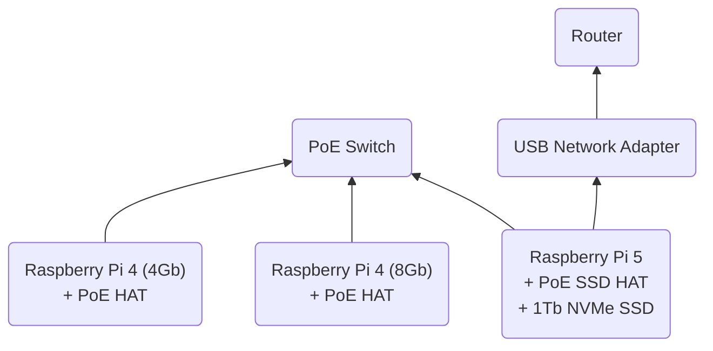

# Cluster Setup

> Most of this guide was based on the [How to build a Raspberry Pi cluster](https://www.raspberrypi.com/tutorials/cluster-raspberry-pi-tutorial/) article.

## Configure the Cluster Head Node (Raspberry Pi 5)

We will use the Raspberry Pi 5 as the head node of the cluster as well as the server for network booting the other Raspberry Pis.
The OS will be installed on the 1TB NVMe SSD.

### NVMe Boot
1. Install Raspberry Pi OS (Desktop) on the micro SD card. [Instructions](https://www.raspberrypi.com/documentation/computers/getting-started.html#raspberry-pi-imager).
2. Mount the PoE SSD HAT and 1Tb NVMe SSD on the Raspberry Pi 5.
3. Boot the Raspberry Pi 5 from the micro SD card.
4. Format your NVMe drive using Raspberry Pi Imager. You can do this from the Raspberry Pi.
    - Install the Raspberry Pi OS Lite on the NVMe drive.
    - Make sure to setup the wifi connection and enable SSH.
    - Name it `rpi-1`.
5. In a terminal on the Raspberry Pi, run `sudo raspi-config` to open the Raspberry Pi Configuration CLI.
6. Under `Advanced Options > Boot Order`, choose `NVMe/USB boot`. Then, exit `raspi-config` with Finish or the Escape key.
7. Reboot your Raspberry Pi with `sudo reboot`.

For more information, see [NVMe boot](https://www.raspberrypi.com/documentation/computers/raspberry-pi.html#nvme-ssd-boot).

### Network Configuration
1. Connect to the Raspberry Pi 5 via SSH.
2. Connect the USB network adapter to the Raspberry Pi 5.
3. Run `nmcli` to get the name of the network interface.

